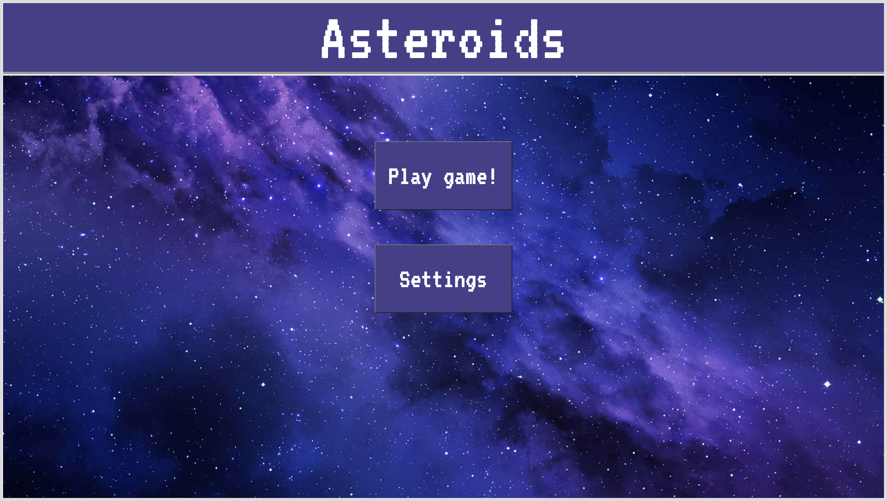
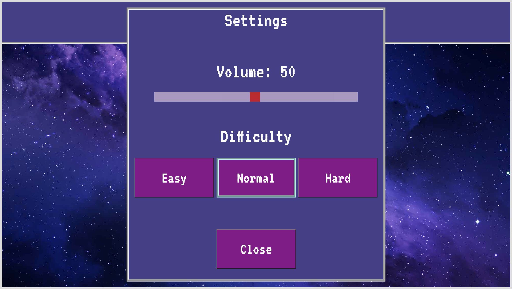
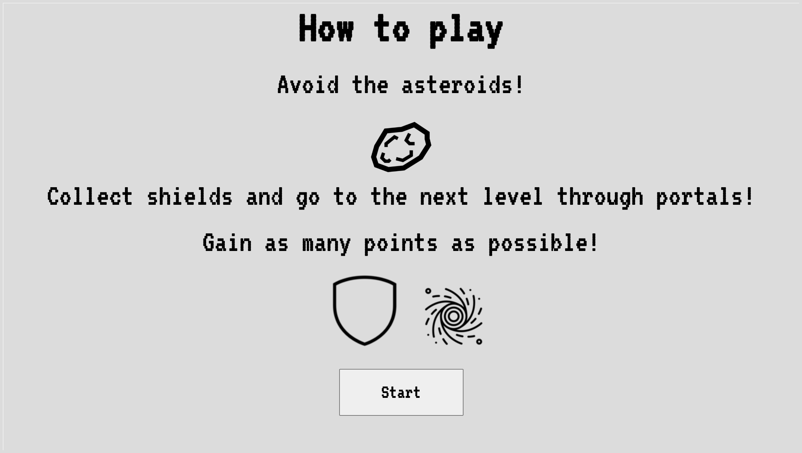
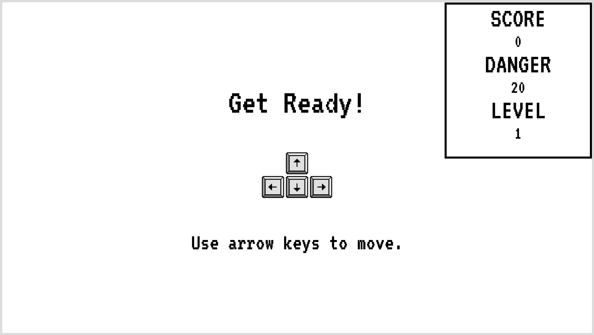
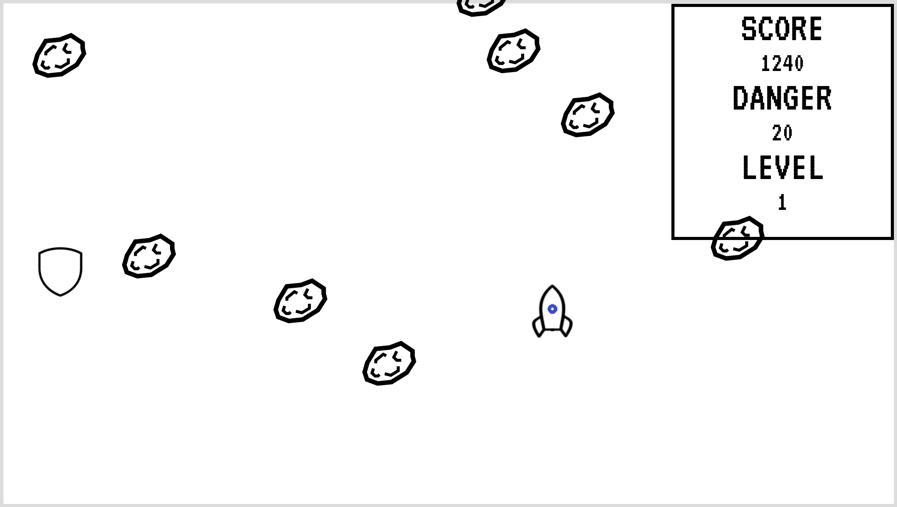
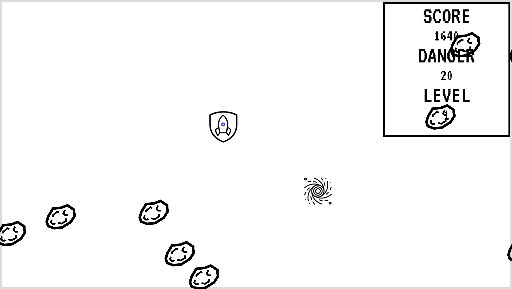
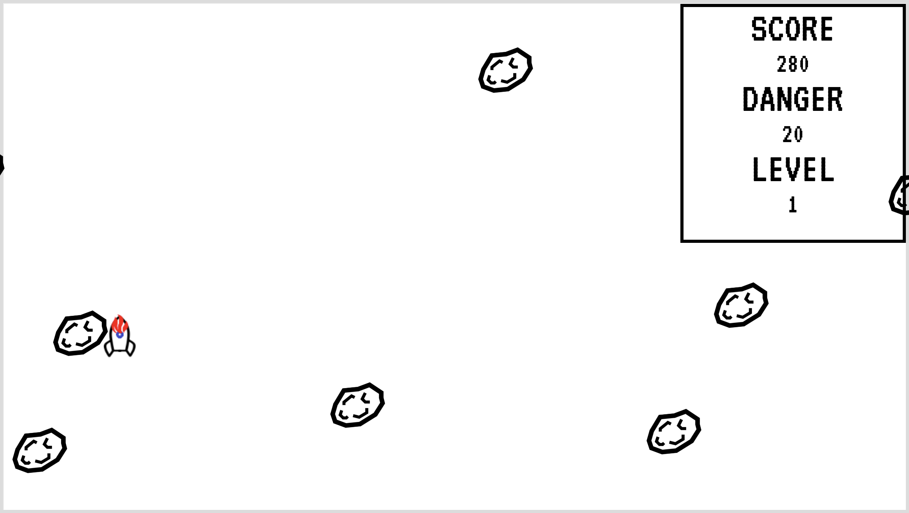
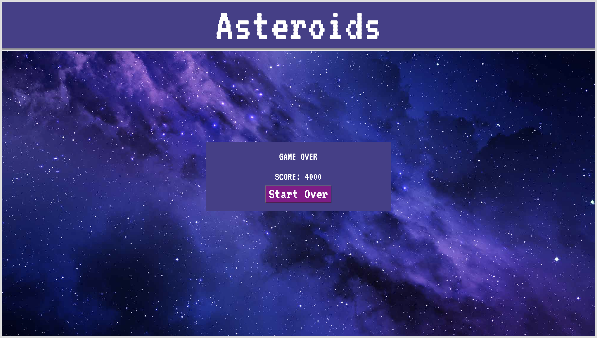

# Asteroids (HTML, CSS, JavaScript)

日本語の説明：https://github.com/rtorii/Asteroids-README/blob/main/README_2.md

[Asteroids game demo video](https://www.youtube.com/watch?v=Znd7PBQw9Hs)

**Description:**

In this game,  a user uses arrow keys to move a rocket (controlled by the user) within the game window to prevent it from getting hit by asteroids. The asteroids spawn randomly from different directions (top, bottom, right, and left). The game window has a fixed size (not resizable). I implemented the application using HTML, CSS, and JavaScript. I also used jQuery, which is an external JavaScript library.

| Landing page | Settings panel |
| ------ | ------ |
|||

**Before the game starts:**

When a user goes to the webpage, the first page shown is the landing page which contains two buttons (`Settings` and `Play game!`). 
- When the user presses the `Settings` button, the settings panel pops up. This is where the user can set the volume and difficulty of the game. There are `Easy`, `Normal`, and `Hard` versions.
- When the user presses the `Play game!` for the first time, the `How to play` page shows up. If the user presses the `Start` button on the `How to play` page, the user is directed to the `Get Ready` splash screen. If the user hits `Start Over` button from the game over page and decides to play the game again, `How to play` page does not show up. After the splash screen appears for three seconds, it automatically disappears and the game starts.

| How to play page | Get Ready splash screen |
| ------ | ------ |
|||

**During the game:**
During the game, the scoreboard on the top right is updated. 
A rocket in the game has two states:
1. Rocket with no shield: Initial state. If a rocket gets hit by an asteroid in this state, the game is over.
2. Rocket with a shield: A rocket can collect a shield spawned at random locations every 15 seconds (and stays for 5 seconds before disappearing). When a rocket with a shield gets hit by an asteroid in this state, the rocket loses the shield. Nothing happens when the rocket who already has a shield collects another shield.

| Rocket with no shield | Rocket with a shield |
| ------ | ------ |
|||

Besides the shield, portals spawn at a random location every 20-second interval (and stays for 5 seconds before disappearing). If a rocket collects a portal, the level increases (speed of the comets increases). Therefore, the rocket may want to collect it if they want to increase the game's difficulty. Otherwise, they may want to avoid it. The portals stop appearing after the speed of the asteroids reaches ten times faster than the initial speed of them in the `Easy` version.

**When the game is over:**

After an asteroid touches a rocket without a shield, the screen changes to the `Game Over` page which displays the score. There is a 'Start Over' button which directs the user back to the landing page where they can do the game again.

| Rocket hit by an asteroid | Game Over page |
| ------ | ------ |
|||

Created by Ryota Torii <rtorii@protonmail.com> on 10/17/21.
