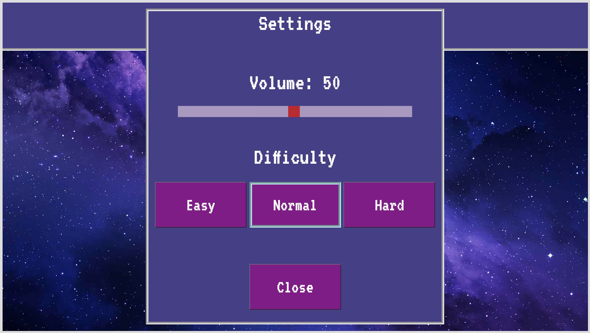
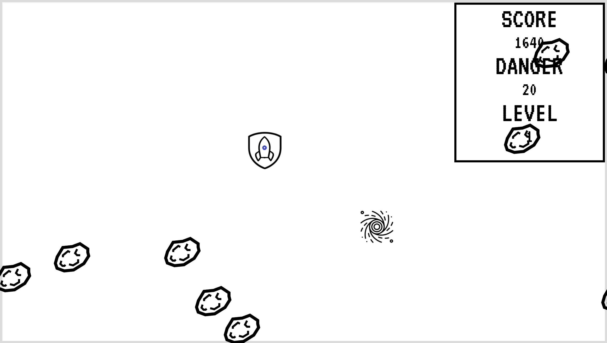
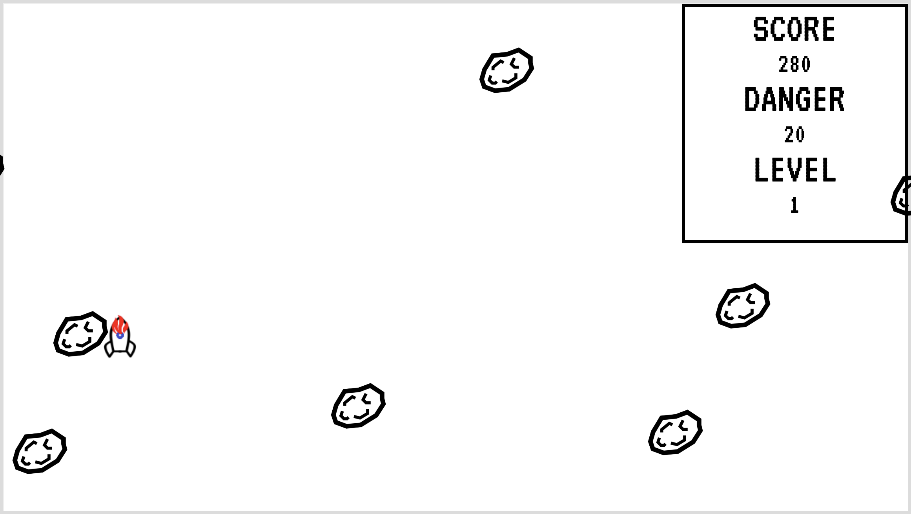
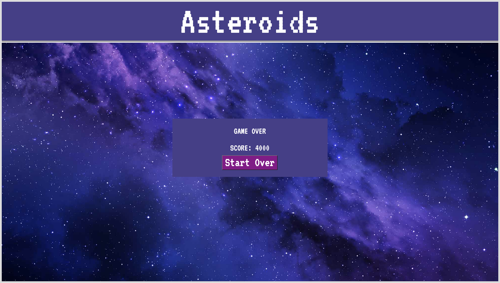

# 小惑星 (HTML, CSS, JavaScript)

[このゲームのプレー動画](https://www.youtube.com/watch?v=Znd7PBQw9Hs)

**説明:**

このゲームはユーザーが方向キーを使って、ロケットをゲームウィンドウ内で動かし、小惑星に当たらないようにするゲームです。小惑星は上下左右の異なる方向からランダムに発生します。

| 最初のページ | 設定パネル |
| ------ | ------ |
|||

| プレーの仕方ページ | スプラッシュスクリーン |
| ------ | ------ |
|||

**ゲーム中:**

右上のスコアボードが更新されます。 
ロケットには2つの状態があります
1. シールド無し: 最初の状態。この状態で小惑星に当たると、ゲームオーバーです。
2. シールドあり: ロケットは15秒ごとにランダムな場所に出現するシールドを集めることができます。シールドを持ったロケットが小惑星に衝突すると、シールドを失います。

| シールド無し | シールドあり |
| ------ | ------ |
|||

シールドの他に、20秒ごとにランダムな場所にポータルが出現します。ロケットがポータルを回収すると、小惑星のスピードが上がり、ゲームのレベルが上がります。

**ゲームオーバー:**

| 小惑星にぶつかる | ゲームオーバーページ |
| ------ | ------ |
|||

10/17/21に作成。
